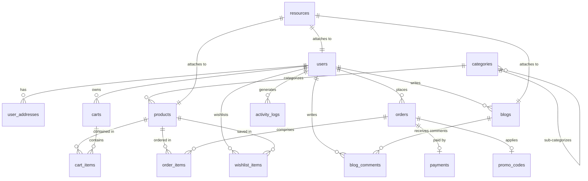

# Database Schema and Relationships

This document outlines the database design for the ARGLOVE-WEB shopping website backend. The database uses MySQL, integrates with **Razorpay** for payment processing, and uses a unified polymorphic resources table for all media uploads.

---

## 1. Entity-Relationship (ER) Diagram



---

## 2. Table Definitions

### 2.1 User & Authentication Tables

#### `users`
Represents customer, admin, and worker credentials.
* **id** (INT, Primary Key, Auto Increment): Unique identifier.
* **email** (VARCHAR(255), Unique, Indexed): User login email.
* **password_hash** (VARCHAR(255)): Securely hashed password.
* **role** (ENUM('customer', 'admin', 'editor'), Default: 'customer'): Access control permissions.
* **is_active** (BOOLEAN, Default: TRUE): Controls account access.
* **reset_token** (VARCHAR(255), Nullable, Indexed): Secure hex token for password recovery.
* **reset_token_expiry** (TIMESTAMP, Nullable): Expiry timestamp of the reset token (valid for 1 hour).
* **created_at** (TIMESTAMP): Timestamp of account creation.
* **updated_at** (TIMESTAMP): Timestamp of last account update.

#### `user_addresses`
Stores billing and shipping addresses for customers.
* **id** (INT, Primary Key, Auto Increment): Unique identifier.
* **user_id** (INT, Foreign Key -> `users.id` ON DELETE CASCADE): Owner of the address.
* **address_type** (ENUM('shipping', 'billing'), Default: 'shipping'): Type of address.
* **recipient_name** (VARCHAR(255)): Name of the package recipient.
* **street_address** (VARCHAR(255)): House number, building, and street name.
* **city** (VARCHAR(100)): Destination city.
* **state** (VARCHAR(100)): Destination state.
* **postal_code** (VARCHAR(20)): PIN or ZIP code.
* **phone_number** (VARCHAR(20)): Delivery contact number.
* **created_at** (TIMESTAMP): Timestamp of entry.

---

### 2.2 Product & Catalog Tables

#### `categories`
Organizes products into nested hierarchies.
* **id** (INT, Primary Key, Auto Increment): Unique identifier.
* **name** (VARCHAR(100)): Display name.
* **slug** (VARCHAR(100), Unique, Indexed): URL-friendly string (e.g., `shoes-sports`).
* **parent_id** (INT, Foreign Key -> `categories.id` ON DELETE SET NULL): Self-referencing link to allow subcategories.

#### `products`
Details catalog items and inventory levels.
* **id** (INT, Primary Key, Auto Increment): Unique identifier.
* **category_id** (INT, Foreign Key -> `categories.id` ON DELETE SET NULL): Links product to its primary category.
* **name** (VARCHAR(255), Indexed): Product title.
* **description** (TEXT): Full description/markdown specifications.
* **regular_price** (DECIMAL(10, 2)): Original base retail price.
* **discount_price** (DECIMAL(10, 2), Nullable): Active discount price.
* **stock_quantity** (INT, Default: 0): Inventory count.
* **is_published** (BOOLEAN, Default: TRUE): Controls storefront visibility.
* **created_at** (TIMESTAMP): Timestamp of entry.
* **updated_at** (TIMESTAMP): Timestamp of last updates.

---

### 2.3 Unified Polymorphic Resources

#### `resources`
A single table managing all image and video uploads across the app.
* **id** (INT, Primary Key, Auto Increment): Unique identifier.
* **file_url** (VARCHAR(512)): CDN or path of the uploaded file.
* **file_name** (VARCHAR(255)): Original file name.
* **mime_type** (VARCHAR(100)): File type (e.g., `image/jpeg`, `image/png`, `video/mp4`).
* **owner_type** (VARCHAR(50), Indexed): Entity table utilizing the resource (e.g., `'Product'`, `'Blog'`, `'User'`).
* **owner_id** (INT, Indexed): Foreign ID corresponding to the `owner_type` table.
* **file_role** (ENUM('thumbnail', 'gallery', 'avatar', 'banner', 'attachment'), Default: 'gallery'): UI role.
* **created_at** (TIMESTAMP): Upload timestamp.

---

### 2.4 Shopping Cart Tables

#### `carts`
Stores active shopping sessions.
* **id** (INT, Primary Key, Auto Increment): Unique identifier.
* **user_id** (INT, Foreign Key -> `users.id` ON DELETE CASCADE, Nullable): Associated customer account (null for guest carts).
* **created_at** (TIMESTAMP): Session start timestamp.
* **updated_at** (TIMESTAMP): Session activity timestamp.

#### `cart_items`
Lists individual products added to a cart.
* **id** (INT, Primary Key, Auto Increment): Unique identifier.
* **cart_id** (INT, Foreign Key -> `carts.id` ON DELETE CASCADE): Shopping cart session.
* **product_id** (INT, Foreign Key -> `products.id` ON DELETE CASCADE): Selected item.
* **quantity** (INT, Default: 1): Units added.

---

### 2.5 Wishlist Tables

#### `wishlist_items`
Stores saved items for customers to buy later.
* **id** (INT, Primary Key, Auto Increment): Unique identifier.
* **user_id** (INT, Foreign Key -> `users.id` ON DELETE CASCADE): Customer who saved the product.
* **product_id** (INT, Foreign Key -> `products.id` ON DELETE CASCADE): Saved product.
* **created_at** (TIMESTAMP): Saved timestamp.
* *Note: Has a unique key `user_product` on (`user_id`, `product_id`) to prevent duplicate saves.*

---

### 2.6 Orders & Razorpay Payments

#### `orders`
A summary of checkouts. Integrated directly with Razorpay.
* **id** (INT, Primary Key, Auto Increment): Unique identifier.
* **user_id** (INT, Foreign Key -> `users.id` ON DELETE RESTRICT): Customer placing the order.
* **promo_code_id** (INT, Foreign Key -> `promo_codes.id` ON DELETE SET NULL, Nullable): Coupon used.
* **total_amount** (DECIMAL(10, 2)): Final total charge.
* **shipping_address** (TEXT): Full snapshot of the shipping address (so past order histories remain intact even if user addresses change).
* **razorpay_order_id** (VARCHAR(255), Unique, Indexed, Nullable): Razorpay Order reference ID generated via API.
* **status** (ENUM('pending', 'processing', 'completed', 'cancelled'), Default: 'pending'): Current checkout status.
* **created_at** (TIMESTAMP): Order timestamp.

#### `order_items`
Details of specific items bought under an order.
* **id** (INT, Primary Key, Auto Increment): Unique identifier.
* **order_id** (INT, Foreign Key -> `orders.id` ON DELETE CASCADE): Order reference.
* **product_id** (INT, Foreign Key -> `products.id` ON DELETE RESTRICT): Item bought.
* **quantity** (INT): Units bought.
* **price_at_purchase** (DECIMAL(10, 2)): Captures the product's price at the moment of checkout.

#### `payments`
Tracks gateway transactions.
* **id** (INT, Primary Key, Auto Increment): Unique identifier.
* **order_id** (INT, Foreign Key -> `orders.id` ON DELETE RESTRICT): Local order.
* **razorpay_order_id** (VARCHAR(255), Indexed): Razorpay Order ID.
* **razorpay_payment_id** (VARCHAR(255), Unique, Indexed, Nullable): Razorpay Payment ID.
* **razorpay_signature** (VARCHAR(255), Nullable): Gateway signature verification token.
* **payment_method** (VARCHAR(50), Nullable): Mode of transaction (`Card`, `UPI`, `Netbanking`).
* **status** (ENUM('created', 'authorized', 'captured', 'failed', 'refunded'), Default: 'created'): Razorpay transaction state.
* **amount** (DECIMAL(10, 2)): Transacted amount.
* **created_at** (TIMESTAMP): Payment attempt timestamp.

---

### 2.7 Blogs & Promotions

#### `blogs`
Marketing posts written by site admins or editors.
* **id** (INT, Primary Key, Auto Increment): Unique identifier.
* **author_id** (INT, Foreign Key -> `users.id` ON DELETE RESTRICT): Publisher user.
* **title** (VARCHAR(255)): Header title.
* **content** (TEXT): Body content markdown/HTML.
* **status** (ENUM('draft', 'published'), Default: 'draft'): Publication state.
* **published_at** (TIMESTAMP, Nullable): Public publish date.

#### `blog_comments`
Visitor feedback on articles.
* **id** (INT, Primary Key, Auto Increment): Unique identifier.
* **blog_id** (INT, Foreign Key -> `blogs.id` ON DELETE CASCADE): Linked article.
* **user_id** (INT, Foreign Key -> `users.id` ON DELETE CASCADE): Author of the comment.
* **comment_body** (TEXT): Comment text.
* **created_at** (TIMESTAMP): Timestamp of entry.

#### `promo_codes`
Discount codes.
* **id** (INT, Primary Key, Auto Increment): Unique identifier.
* **code** (VARCHAR(50), Unique, Indexed): Promocode string (e.g., `SAVE20`).
* **discount_type** (ENUM('percentage', 'fixed'), Default: 'percentage'): Coupon discount type.
* **discount_value** (DECIMAL(10, 2)): Worth of coupon.
* **expiry_date** (TIMESTAMP): Expiry threshold.

---

### 2.8 Administration & Audit

#### `activity_logs`
Chronological database actions tracking system behaviors.
* **id** (INT, Primary Key, Auto Increment): Unique identifier.
* **user_id** (INT, Foreign Key -> `users.id` ON DELETE SET NULL, Nullable): Acting user.
* **action** (VARCHAR(255)): Event description.
* **ip_address** (VARCHAR(45)): User IP.
* **created_at** (TIMESTAMP): Log timestamp.

---

## 3. Relationships and Cascade Behaviors

* **One-to-Many (`1:N`)**:
  * `users` -> `user_addresses`: A user can register multiple addresses. Deleting a user deletes their addresses (`ON DELETE CASCADE`).
  * `users` -> `wishlist_items`: A user can save multiple products in their wishlist. Deleting a user clears their wishlist (`ON DELETE CASCADE`).
  * `categories` -> `products`: A category contains many products. Deleting a category sets the product category reference to null (`ON DELETE SET NULL`).
  * `orders` -> `order_items`: An order holds multiple line items. Deleting an order deletes its line items (`ON DELETE CASCADE`).
  * `blogs` -> `blog_comments`: An article contains multiple comments. Deleting an article clears its comments (`ON DELETE CASCADE`).
* **Many-to-Many (`N:M`)**:
  * `products` <-> `orders` via `order_items`.
  * `products` <-> `carts` via `cart_items`.
  * `products` <-> `users` via `wishlist_items`.
* **Polymorphic (`1:N`) Resource Link**:
  * `resources` links to `products`, `blogs`, and `users` using `owner_type` and `owner_id`. No standard foreign keys exist; verification is enforced by the backend service level.

---

## 4. Razorpay Transaction Lifecycle Workflow

```
[ Frontend: Click Checkout ]
            │
            ▼
[ Backend: Create Local Order ] 
  - Save details in `orders` (status = 'pending')
  - Call Razorpay API: `orders.create` (send total_amount in paise)
  - Receive `razorpay_order_id`
  - Update `orders.razorpay_order_id` in database
            │
            ▼
[ Frontend: Open Razorpay Checkout Widget ]
  - Pass `razorpay_order_id` to client JS widget
  - Customer completes payment transfer
  - Widget returns: `razorpay_payment_id` & `razorpay_signature`
            │
            ▼
[ Backend: Verification and Capture ]
  - Compare locally-generated signature hash with `razorpay_signature`
  - If MATCHED:
    - Insert transaction record into `payments` table
    - Update `orders.status` to 'processing'
    - Deduct items from `products.stock_quantity`
```
